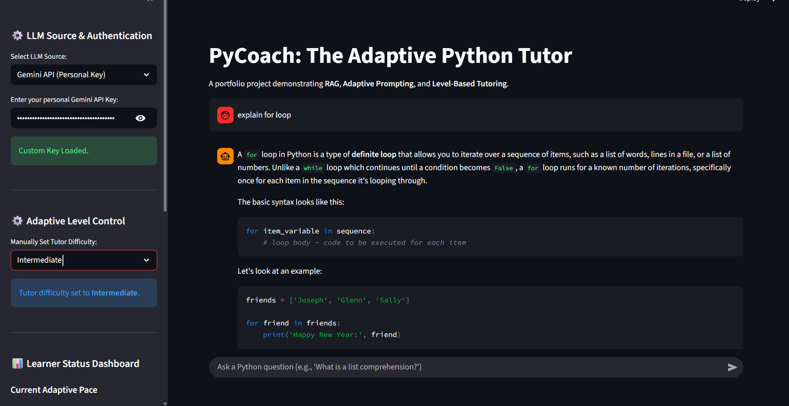
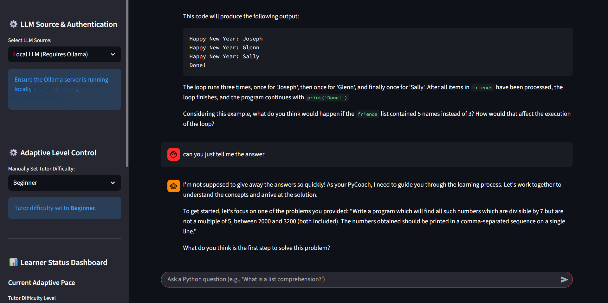

#  PyCoach: Adaptive RAG-Powered Python Tutor

**PyCoach** is a proof-of-concept application demonstrating a personalized **Retrieval-Augmented Generation (RAG)** system that leverages **User Modeling** and **Adaptive Prompting** to create an intelligent tutoring platform for **Python programming**.

The tutor employs a **Socratic teaching style**, dynamically adjusting its complexity based on the learner’s self-selected level.  
This project showcases robust **LangChain Expression Language (LCEL)** chains, **hybrid LLM deployment options**.

---

## Core Innovations & Technology Stack



| **Feature** | **Concept Implemented** | **Why It Was Used (Value Proposition)** |
|--------------|--------------------------|-----------------------------------------|
| **Adaptive Prompting** | Level-Based Socratic Method | The tutor’s system prompt strictly enforces the “Explain First, Then Ask” rule, with complexity tailored to Beginner, Intermediate, or Expert levels — creating genuine scaffolding. |
| **High-Performance RAG** | BGE Embeddings & Optimized Retrieval | Achieves fast and accurate retrieval using local **BAAI/bge-small-en-v1.5** embeddings on a specialized knowledge base, ensuring grounded responses. |
| **Hybrid LLM Backend** | Cloud & Local Deployment | Offers two distinct options — **low-latency Gemini API** and **zero-cost, private Ollama/Llama 3** local deployment — maximizing flexibility and privacy. |
| **User Modeling** | Level Control & Status Dashboard | Provides transparent visibility into the current adaptive level, topic coverage, and next steps, removing reliance on mock score systems. |

---

##  RAG Design Decision (Optimization Note)

The application was initially designed with a **Cross-Encoder Reranker** to improve retrieval precision.  
However, evaluation showed that the **latency** introduced by the large reranker model outweighed the minimal accuracy gain from the already high-performing **BGE embeddings**.

 Therefore, the final architecture uses **direct BGE retrieval** (`k=5` chunks) for **maximum speed and efficiency**.

---

##  Architecture and Components

PyCoach is organized into **three containerized services**, managed by `docker-compose.yml`:

| **Component** | **Description** | **Technologies** |
|----------------|-----------------|------------------|
| **backend** | FastAPI application coordinating RAG and Adaptive Logic. Handles `ChatRequest`, loads appropriate LLM, builds LCEL chain, and manages conversational history. | FastAPI, Uvicorn, LangChain (0.1.0), ChromaDB, ChatGoogleGenerativeAI, ChatOllama |
| **frontend** | Streamlit user interface managing session state, secure API key input, chat interface, and adaptive level selector. | Streamlit, Pandas (for data visualization) |
| **ollama** | External service providing Llama 3 for the zero-cost option. | Ollama, Llama 3 |



---

##  Security and Dependency Management

- **API Key Security:**  
 
  All Gemini API usage requires the user to input their **personal key** securely via the Streamlit sidebar, protecting developer credentials.

- **Version Control:**  
  I used  a fixed `langchain==0.1.0` dependency stack (documented in `requirements.txt`), allowing robust custom logic (e.g., manual reranker implementation) without risk from breaking changes.

- **.gitignore Configuration:**  
  The `.env` file containing secrets is **explicitly excluded** from version control.

---


###  Prerequisites

1. Python 3.10+

2. Llama 3:8b (optional, for the zero-cost local LLM option)

---

###  Installation Steps

1. **Clone the Repository**
   ```bash
   git clone https://github.com/YourUsername/PyCoach.git
   cd PyCoach
2. **Setup Virtual Environment & Install Dependencies**
	```bash
	python -m venv venv
	source venv/bin/activate  # Use `.\venv\Scripts\activate` on Windows
	pip install -r requirements.txt
	```
3. **Prepare Course Materials**

  	Place your Python reference documents (PDFs, Markdown, or text files) into the local directory:
	```bash
	course_materials/
	```
4. **Authentication** 
	 Create a file named .env in the root directory and add your Gemini API Key:	
	```bash
	GEMINI_API_KEY="YOUR_API_KEY_HERE"
	```
5. **Build and Index the RAG Pipeline**

	Run the indexing script to process your documents and build the vector store.
	```bash	
	python backend/rag_pipeline.py
	```

6. **Start the Backend (FastAPI)**

	```bash
	uvicorn backend.app:app --reload
	```

7. **Start the Frontend (Streamlit)**
	
	 Open a new terminal tab within the project root, ensure your virtual environment is active, and run:

	```Bash
	streamlit run frontend/app.py
	```
8. **Access the Application**
 Open your browser and navigate to: http://localhost:8501
---
## Tech Stack Overview

 Backend: FastAPI, LangChain (LCEL), ChromaDB

 Frontend: Streamlit

Local Model Hosting: Ollama (Llama 3)

Cloud Model Option: Gemini API

Embeddings: BAAI/bge-small-en-v1.5 

---


## Author: Aviral Mishra

## License: [MIT](https://github.com/AviralMishra039/Pycoach/blob/main/LICENSE)